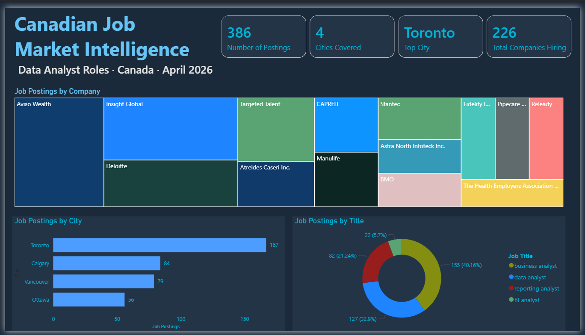

# Canadian Job Market Intelligence
### Automated ETL pipeline and Power BI dashboard analyzing data analyst job postings across Canada

[](https://app.powerbi.com/reportEmbed?reportId=cccd11b8-77dd-40c2-8854-ffbe08e7e851&autoAuth=true&ctid=76ae1115-1efc-4af2-a536-e2b2443af1a0)
[](pipeline/adzuna_test.py)

---

## Key Insights

> Data collected April 2026 · 386 active postings · 4 Canadian cities

- **Toronto dominates** the Canadian market with 167 postings — nearly double Calgary (84) and Vancouver (79)
- **226 unique companies** are actively hiring across data analyst roles, indicating a broad and distributed market
- **Business Analyst** is the most posted title (40.16%), followed by Data Analyst (32.9%), Reporting Analyst (21.24%), and BI Analyst (5.7%)
- **Staffing agencies** (Aviso Wealth, Insight Global, Targeted Talent) drive significant posting volume, suggesting strong contract and placement activity in the market
- **Ottawa** trails other cities with 56 postings, reflecting its public sector hiring pace vs. private sector markets

---

## Dashboard Preview



🔗 **[View Live Report](https://app.powerbi.com/reportEmbed?reportId=cccd11b8-77dd-40c2-8854-ffbe08e7e851&autoAuth=true&ctid=76ae1115-1efc-4af2-a536-e2b2443af1a0)**

---

## Project Architecture

```
Adzuna Jobs API
      │
      ▼
adzuna_test.py        ← Fetches postings across 4 job titles × 4 cities
      │                  Loops, deduplicates, writes raw CSV
      ▼
jobs_YYYY-MM-DD.csv   ← Raw data (417 rows before dedup)
      │
      ▼
clean_jobs.py         ← Deduplicates on URL, runs keyword enrichment
      │                  Adds binary skill columns + skills_found summary
      ▼
jobs_YYYY-MM-DD_clean.csv  ← Enriched dataset (386 clean rows)
      │
      ▼
Power BI Desktop      ← Connects to clean CSV, builds dashboard
      │
      ▼
Power BI Service      ← Published, publicly accessible report
```

This architecture mirrors the [Ontario Rental Intelligence](https://github.com/EmmanuelAkinbile/ontario-rental-intelligence) project — ETL handled entirely in Python, all analysis and visualization in Power BI.

---

## Files

| File | Description |
|---|---|
| [`adzuna_test.py`](pipeline/adzuna_test.py) | Main fetch script — calls Adzuna API, loops across job titles and cities, writes raw CSV |
| [`clean_jobs.py`](pipeline/clean_jobs.py) | Cleaning and enrichment script — deduplicates, runs skill keyword matching, outputs enriched CSV |
| [`run_pipeline.bat`](pipeline/run_pipeline.bat) | Runner script — chains both Python scripts in sequence, logs each run with timestamps to run_log.txt |

---

## Data Pipeline

### Fetch (`adzuna_test.py`)
- Calls the [Adzuna Jobs API](https://developer.adzuna.com/) for Canadian postings
- Loops across **4 job titles**: Data Analyst, Business Analyst, BI Analyst, Reporting Analyst
- Loops across **4 cities**: Toronto, Vancouver, Ottawa, Calgary
- Pulls 50 results per search combination (16 total API calls)
- Writes timestamped raw CSV with fields: Title, Company, Location, Salary Min, Salary Max, Date Posted, Search Title, Search City, Description, URL

### Clean & Enrich (`clean_jobs.py`)
- Deduplicates on URL to remove postings that appear across multiple search queries
- Runs keyword matching across 20 skills against the Description field
- Outputs binary skill columns (1 = mentioned, 0 = not) for use in Power BI
- Adds `skills_found` summary column listing all matched skills per posting
- Writes timestamped enriched CSV

**Skills tracked:**
`SQL · Python · Excel · Power BI · Tableau · R · Azure · AWS · Snowflake · Databricks · ETL · DAX · Statistics · AI · Machine Learning · LLM · Generative AI · Copilot · NLP · Automation`

---

## Dashboard

Built in Power BI Desktop and published to Power BI Service.

**Page 1 — Market Overview**
- KPI cards: Total Postings, Cities Covered, Top Hiring City, Total Companies Hiring
- Job Postings by City (bar chart)
- Job Postings by Title (donut chart)
- Top Hiring Companies (treemap)
- Dynamic subtitle updates automatically on data refresh

---

## Tools & Technologies

| Tool | Purpose |
|---|---|
| Python | ETL pipeline — data extraction, cleaning, enrichment |
| pandas | Deduplication and keyword matching |
| Adzuna API | Source of Canadian job posting data |
| Power BI Desktop | Dashboard development |
| Power BI Service | Report publishing and sharing |
| DAX | Calculated measures and dynamic report elements |
| Power Automate Desktop | Automation layer — orchestrates daily pipeline execution |
| Windows Task Scheduler | Triggers Power Automate Desktop flow on a daily schedule |

---

## Limitations & Phase 2 Roadmap

### Current Limitations
- **Description snippets** — The Adzuna free tier returns short description previews rather than full job posting text. Skill mention frequencies reflect snippet content only and likely underrepresent actual demand for core tools like SQL and Python which appear deeper in job requirements sections.
- **Salary data** — 73% of postings do not include structured salary fields. Some salary ranges appear within description text and are not yet extracted.
- **Single snapshot** — Data is captured at a point in time. Postings older than a few weeks may have already expired, creating recency bias.

### Phase 2 (Planned)
- **AI enrichment layer** — Python script using an LLM to extract structured skills and salary data from description text, outputting an enriched CSV that feeds back into the existing Power BI report without rebuilding visuals
- **Automated scheduling ✅** — Power Automate Desktop flow built and tested; daily schedule configured via Windows Task Scheduler. Pipeline runs automatically each day and logs results to run_log.txt
- **City expansion** — Adding Montreal, Edmonton, and Winnipeg to broaden geographic coverage
- **Historical tracking** — Accumulating daily snapshots to enable genuine posting trend analysis over time

---

## About

Built by **Emmanuel Akinbile** — Economics graduate (Brock University, 2025), Microsoft Certified Power BI Data Analyst (PL-300).

🔗 [LinkedIn](https://linkedin.com/in/emmanuel-akinbile) · [GitHub](https://github.com/EmmanuelAkinbile) · [Ontario Rental Intelligence Project](https://github.com/EmmanuelAkinbile/ontario-rental-intelligence)
