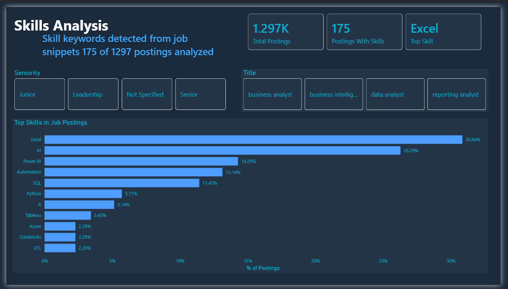
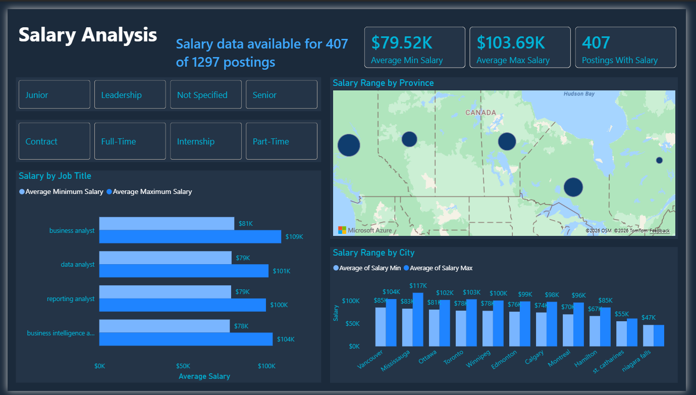

# Canadian Job Market Intelligence
### Automated ETL pipeline and Power BI dashboard analyzing data analyst job postings across Canada

[](https://app.powerbi.com/reportEmbed?reportId=cccd11b8-77dd-40c2-8854-ffbe08e7e851&autoAuth=true&ctid=76ae1115-1efc-4af2-a536-e2b2443af1a0)
[](pipeline/adzuna_test.py)

---

## Key Insights

> Data collected April 2026 · 386 active postings · 4 Canadian cities

- **Toronto dominates** the Canadian market with 235 postings, ahead of Montreal (201) and Calgary (175)
- **513 unique companies** are actively hiring across data analyst roles, indicating a broad and distributed market
- **Business Analyst** is the most posted title (35.9%), followed by Data Analyst (30.8%), Reporting Analyst (21.5%), and BI Analyst (11.8%)
- **Staffing agencies** (Insight Global, Targeted Talent, P@thlion) drive significant posting volume, suggesting strong contract and placement activity
- **Excel and AI** are the most frequently mentioned skills, appearing in 30.9% and 26.3% of analyzed postings respectively

---

## Dashboard Preview





🔗 **[View Live Report](https://app.powerbi.com/reportEmbed?reportId=cccd11b8-77dd-40c2-8854-ffbe08e7e851&autoAuth=true&ctid=76ae1115-1efc-4af2-a536-e2b2443af1a0)**

---

## Project Architecture

```
Adzuna Jobs API          CareerJet API
     │                        │
     ▼                        ▼
adzuna_test.py         careerjet_fetch.py   ← Fetch scripts run Mon/Thu via Task Scheduler
     │                        │
     ▼                        ▼
jobs_YYYY-MM-DD.csv    jobs_careerjet_YYYY-MM-DD.csv
     │                        │
     ▼                        ▼
clean_jobs.py          clean_careerjet.py   ← Clean, enrich, add skill/seniority/contract columns
     │                        │
     ▼                        ▼
jobs_YYYY-MM-DD_clean.csv     jobs_careerjet_YYYY-MM-DD_clean.csv
     │                        │
     ▼                        ▼
update_latest.py       update_careerjet_latest.py  ← Copy to latest CSV for Power BI
     │                        │
     ▼                        ▼
jobs_latest_clean.csv  careerjet_latest_clean.csv
     │                        │
     ▼                        ▼
             OneDrive Sync  ← Automatic cloud sync
                 │
                 ▼
          Power BI Desktop  ← Appends both sources into combined_postings table
                 │
                 ▼
          Power BI Service  ← Published, publicly accessible report
```

This architecture mirrors the [Ontario Rental Intelligence](https://github.com/EmmanuelAkinbile/ontario-rental-intelligence) project — ETL handled entirely in Python, all analysis and visualization in Power BI.

---

## Files

| File | Description |
|---|---|
| [`adzuna_test.py`](pipeline/adzuna_test.py) | Fetches postings from Adzuna API across job titles and cities, writes raw CSV |
| [`clean_jobs.py`](pipeline/clean_jobs.py) | Cleans and enriches Adzuna data — deduplicates, runs skill keyword matching, adds seniority and contract type columns |
| [`update_latest.py`](pipeline/update_latest.py) | Copies today's clean Adzuna CSV to jobs_latest_clean.csv |
| [`careerjet_fetch.py`](pipeline/careerjet_fetch.py) | Fetches postings from CareerJet API across job titles and cities, writes raw CSV |
| [`clean_careerjet.py`](pipeline/clean_careerjet.py) | Cleans and enriches CareerJet data — deduplicates, runs skill keyword matching, adds seniority and contract type columns |
| [`update_careerjet_latest.py`](pipeline/update_careerjet_latest.py) | Copies today's clean CareerJet CSV to careerjet_latest_clean.csv |
| [`run_pipeline.bat`](pipeline/run_pipeline.bat) | Runner script — chains all 6 scripts in sequence, logs each run with timestamps to run_log.txt |

---

## Data Pipeline

### Fetch
- **Adzuna** (`adzuna_test.py`) — Calls the [Adzuna Jobs API](https://developer.adzuna.com/) for Canadian postings across 4 job titles and 11 cities
- **CareerJet** (`careerjet_fetch.py`) — Calls the CareerJet API for Canadian postings across the same job titles and cities
- Both scripts write timestamped raw CSVs with fields: Title, Company, Location, Salary Min, Salary Max, Date Posted, Description, URL
- Pipeline runs Monday and Thursday via Windows Task Scheduler

### Clean & Enrich
- Deduplicates on URL to remove postings appearing across multiple search queries
- Runs keyword matching across 20 skills against the Description field
- Outputs binary skill columns (1 = mentioned, 0 = not) for use in Power BI
- Adds `skills_found` summary column listing all matched skills per posting
- Adds `seniority_level` column — parsed from Title and Description: Junior, Senior, Leadership, Not Specified
- Adds `contract_type` column — parsed from Title and Description: Full-Time, Contract, Internship, Part-Time

**Skills tracked:**
`SQL · Python · Excel · Power BI · Tableau · R · Azure · AWS · Snowflake · Databricks · ETL · DAX · Statistics · AI · Machine Learning · LLM · Generative AI · Copilot · NLP · Automation`

---

## Dashboard

Built in Power BI Desktop and published to Power BI Service. Both sources are appended into a single `combined_postings` fact table in Power Query, with a `source` column preserving origin for filtering.

All three pages support filtering by **Seniority Level** and **Contract Type**.

**Page 1 — Market Overview**
- KPI cards: Total Postings, Cities Covered, Top Hiring City, Total Companies Hiring
- Job Postings by City (bar chart)
- Job Postings by Title (donut chart)
- Top Hiring Companies (treemap)

**Page 2 — Skills Analysis**
- Top Skills in Job Postings (horizontal bar chart, % of postings)
- KPI cards: Total Postings, Postings With Skills, Top Skill
- Filter by Seniority Level and Job Title

**Page 3 — Salary Analysis**
- KPI cards: Average Salary Min, Average Salary Max, Postings With Salary
- Salary Range by Job Title (clustered bar chart)
- Salary Range by Province (map)
- Salary Range by City (clustered bar chart)

---

## Tools & Technologies

| Tool | Purpose |
|---|---|
| Python | ETL pipeline — data extraction, cleaning, enrichment |
| pandas | Deduplication and keyword matching |
| Adzuna API | Primary source of Canadian job posting data |
| CareerJet API | Secondary source of Canadian job posting data |
| Power BI Desktop | Dashboard development |
| Power BI Service | Report publishing and sharing |
| DAX | Calculated measures and dynamic report elements |
| Power Automate Desktop | Automation layer — orchestrates daily pipeline execution |
| Windows Task Scheduler | Triggers Power Automate Desktop flow on a daily schedule |

---

## Limitations & Phase 2 Roadmap

- **Description snippets** — Both APIs return short description previews rather than full posting text. Skill mention frequencies reflect snippet content only and likely underrepresent actual demand for tools like SQL and Python which appear deeper in job requirements.
- **Salary data** — The majority of postings do not include structured salary fields. Salary analysis is based on the subset of postings where salary data is available.

## Phase 3 Roadmap

- **Time Intelligence** — As daily CSV snapshots accumulate, the pipeline will support genuine longitudinal analysis: tracking which skills are rising or declining in demand week-over-week, identifying seasonal hiring patterns, and measuring how posting volume shifts across cities over time. The infrastructure is already in place — this becomes available naturally as the dataset grows.

- **Cloud Storage Migration** — Migrating raw and enriched CSVs from local OneDrive sync to Azure Blob Storage, enabling a fully cloud-native pipeline that runs independently of a local machine. This would replace the current Task Scheduler setup with Azure-native scheduling and eliminate the dependency on an always-on local environment.

- **Video Walkthrough** — A short recorded walkthrough of the pipeline architecture and dashboard, demonstrating the end-to-end flow from API fetch to published report.

---

## About

Built by **Emmanuel Akinbile** — Economics graduate (Brock University, 2025), Microsoft Certified Power BI Data Analyst (PL-300).

🔗 [LinkedIn](https://linkedin.com/in/emmanuel-akinbile) · [GitHub](https://github.com/EmmanuelAkinbile) · [Ontario Rental Intelligence Project](https://github.com/EmmanuelAkinbile/ontario-rental-intelligence)
